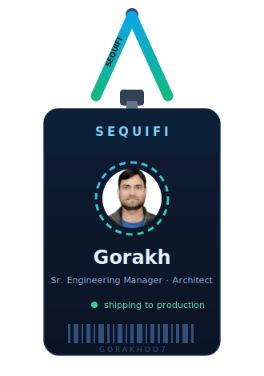

 

<table align="center" border="0">
<tr>
<td width="38%" align="center" valign="middle">

</td>
<td width="62%" valign="middle">

### ⚡ What I do

**Senior Engineering Manager & Solutions Architect** — I design enterprise-scale
systems, lead the teams that build them, and still ship code to production.
Currently building **payment infrastructure** at Sequifi: onboarding funnels,
KYC pipelines, subscription billing, and the ops tooling around them.

- 🏛️ Architecture governance — HLD/LLD reviews, monolith→microservices, event-driven design
- 🏗️ Cloud-native on **AWS** — Lambda, Step Functions, DynamoDB, SQS, EventBridge
- 💳 **Stripe** billing flows — checkout, subscriptions, dunning, reconciliation
- 🤖 AI/LLM systems — agentic platforms, RAG, evaluation frameworks
- 👥 Mentoring senior engineers & aligning system design with business outcomes

### 🧰 Tools I reach for

> 💡 *"Merged is not deployed."*

</td>
</tr>
</table>

 

### 🛤️ The journey — 12+ years

| | Role | Where | When |
|:---:|:---|:---|:---|
| 🏗️ | **Senior Engineering Manager · System Architect** | Sequifi | 2022 → now |
| 👨‍✈️ | Technical Team Lead | Apptology | 2020 → 2022 |
| ⚙️ | Senior PHP Developer | Asterro Technologies | 2017 → 2020 |
| 🌱 | PHP Developer | RailsBox Technologies | 2014 → 2016 |

🎓 B.E. Computer Science — NIMS University

 

### 📊 GitHub Stats

  

  

  

  

### 🐍 The snake eats my contributions

<picture>
  <source media="(prefers-color-scheme: dark)" srcset="https://raw.githubusercontent.com/gorakhoo7/gorakhoo7/output/github-snake-neon.svg"/>
  
</picture>

  

### 📫 Connect

